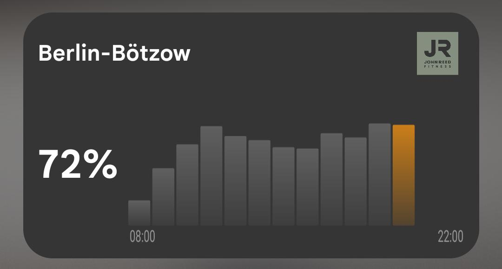

# 2Packd

You wanted to get a 6 pack. But the gym is, unfortunately, 2 packed. **2Packd** is an Android home-screen widget that displays how busy your gym is in real-time, so you now have yet another reason to skip it.

It currently supports 786 total gyms from the following gym chains: 

* All Inclusive Fitness
* FitX
* Fitness First
* Gold's Gym
* John Reed
* McFit

If you have any suggestions, feedback, or additional gyms you would like to add, reach out at [emanuelederossi313@gmail.com](mailto:myemail@gmail.com)! Feel also free to open a PR for any suggestions/bugs.

<p align="center">
  
</p>


## Download

**Note:** This is an unofficial APK. You'll need to enable "Install unknown apps" in Android settings.

[Download latest APK](https://github.com/EmanueleDeRossi1/gym-occupancy-android-widget/releases/latest)

## Architecture

The project consists of two components.

### Android Widget (Kotlin)

The Android widget:

* fetches occupancy data from the API
* displays current occupancy
* renders a utilization chart
* allows users to select their gym

Technologies used:

* Kotlin
* Coroutines
* OkHttp
* Android AppWidget API

---

### Serverless API Proxy

A serverless worker that aggregates and normalizes gym APIs.

Responsibilities:

* fetch gym lists from providers
* normalize responses across operators
* expose a unified API for the widget

Endpoints:

```
GET /gyms
```

Returns the list of available gyms.

```
GET /{operatorId}/{gymId}/occupancy
```

Returns occupancy time slots for a gym.

```
POST /trigger
X-Trigger-Secret: <secret>
```

Manually triggers the scheduled job that re-fetches and caches all gym lists in KV storage. Protected by a secret token.

---

### Deploying the Proxy

```bash
cd proxy
npm run deploy
```
