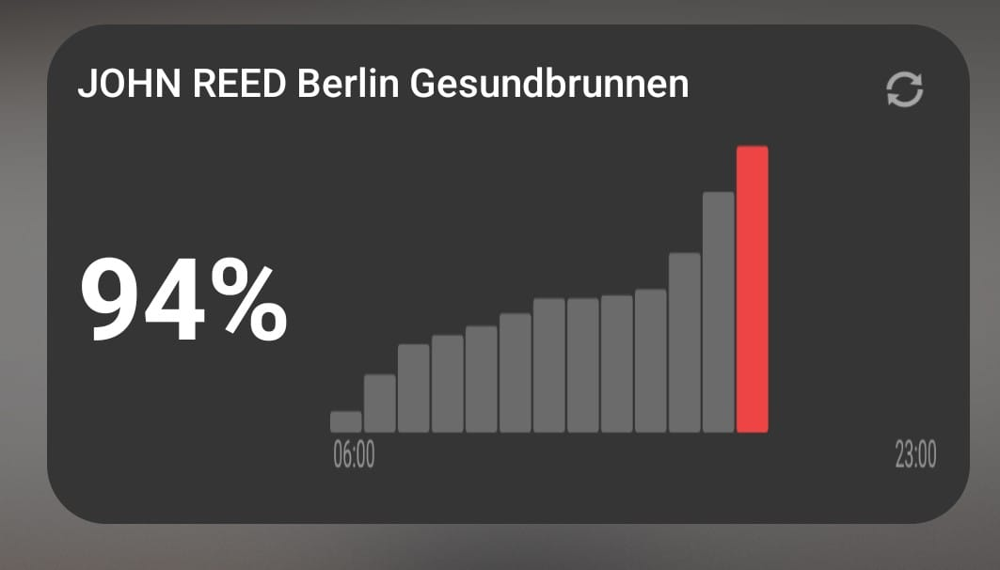

# Gym Occupancy Widget

An Android home-screen widget that displays real-time gym occupancy and daily utilization charts.

It currently supports 784 total gyms from the following gym chains: 

* John Reed
* McFit
* FitX
* Gold's Gym
* Fitness First
* All Inclusive Fitness

If you have any suggestions, feedback, or additional gyms you would like to add, reach out at [emanuelederossi313@gmail.com](mailto:myemail@gmail.com)!

<p align="center">
  
</p>

**⚠️  Note:** As this is still a work-in-progress, the widget is still not downloadable as an APK file.


## Architecture

The project consists of two components.

### Android Widget (Kotlin)

The Android widget:

* fetches occupancy data from the API
* displays current occupancy
* renders a utilization chart
* allows users to select their gym

Technologies used:

* Kotlin
* Coroutines
* OkHttp
* Android AppWidget API

---

### Serverless API Proxy

A serverless worker that aggregates and normalizes gym APIs.

Responsibilities:

* fetch gym lists from providers
* normalize responses across operators
* expose a unified API for the widget

Endpoints:

```
GET /gyms
```

Returns the list of available gyms.

```
GET /{operatorId}/{gymId}/occupancy
```

Returns occupancy time slots for a gym.
